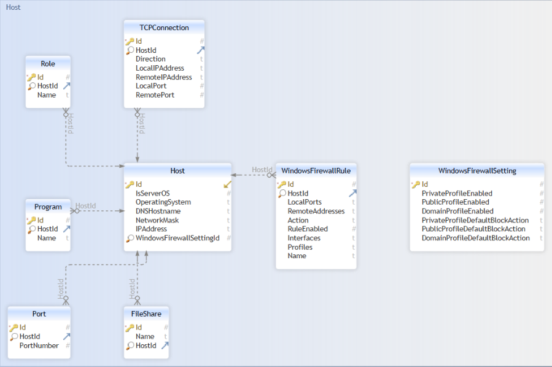

       ,_     _,            _____          __  .__              .__
         '._.'             /  _  \   _____/  |_|__| ____   ____ |__| ______
    '-,   (_)   ,-'       /  /_\  \ /    \   __\  |/ ___\ /    \|  |/  ___/
      '._ .:. _.'        /    |    \   |  \  | |  / /_/  >   |  \  |\___ \
       _ '|Y|' _         \____|__  /___|  /__| |__\___  /|___|  /__/____  >
     ,` `>\ /<` `,               \/     \/       /_____/      \/        \/
    ` ,-`  I  `-, `
      |   /=\   |        
    ,-'   |=|   '-,      
          )-(
          \_/


# Usage
```
How to use:
        --settings:
                Displays a form where settings can be viewed or modified
        --database:
                Location of Antignis database. Defaults to startup directory
        --wsbaseline:
                Creates a baseline for workstations
        --srvbaseline:
                Creates a baseline for servers
        --generatetestdata:
                Generates testdata to play with
        --importfiles:
                Import files from a location on disk. Specify location after flag:
                --importfiles C:\tmp
        --configuresavelocation:
                Creates the specified folder and configures it such that users can only write to it.  
                Specify location after flag:
                --configuresavelocation \\remoteUNC\sharename\Folder
        --importad:
                Import hosts from Active Directory
        --help:
                Shows this message
```

When you first start Antignis, it will ask you to specify the following information:  
-  Name of the group that contains admin users
-  Name of the group that contains bastion hosts, if applicable
-  If you want to restrict access to designated admins, logged in on designated bastion hosts.
-  The Organization Unit in which new groups can be created.


# Features

## Ingest hosts from Active Directory

To import hosts from Active Directory, specify the `--importad` argument. Antignis will query the AD for computer accounts and based on the OS description, it will be classified as workstation or server.

Example: `.\Antignis.Server.exe --importad`

## Ingest hosts from files

If Antignis.Client has been used to gather information (or any other tool that outputs relevant data in the correct JSON format), the JSON files can be ingested into the local database. To do this:

`.\Antignis.Server.exe --importfiles \\fileshare\Files`

If the FQDN/DNSHostname of the host does not exist in the database, a new entry will be added. If it does exist, all information will be overwritten, except for TCPConnections. These will be added to the database.

## Create workstation baseline

A firewall configuration baseline for workstations can be created. This will block inbound access on the following ports:
|Protocol                       | Portnumber  |
|---                            |---|
|**SSH**                        |22 |
|**Telnet**                     |23|
|**WMI**                        |135|
|**SMB**                        |139|
|                               |445|
|**RDP**                        |3389|
|**VNC**                        |5900|
|**Teamviewer**                 |5938|
|**Windows Remote Management**  |5985|
|                               |5986|

All ports added to the exceptionlist (found in the settingsmenu) will be skipped. 

Example: `.\Antignis.Server.exe --wsbaseline`


## Create server baseline

A firewall configuration baseline for servers can be created. This will block inbound access on the following ports:
|Protocol                       |Portnumber|
|---                            |---|
|**SSH**                        |22|
|**Telnet**                     |23|
|**RDP**                        |3389|
|**VNC**                        |5900|
|**Teamviewer**                 |5938|
|**Windows Remote Management**  |5985|
|                               |5986|

All ports added to the exceptionlist (found in the settingsmenu) will be skipped. For servers, this defaults to:
|Protocol   | Portnumber  |
|---        |---|
| **WMI**   | 135  |
|**SMB**    |139|
|           |445|

Example: `.\Antignis.Server.exe --srvbaseline`

## Edit application settings

To edit application specific settings, start Antignis with the following parameter: 
`.\Antignis.Server.exe --settings`

The following settings can be modified: 
|Setting name                       |Description|
|---                                |---|
|**BastionGroupDN**                 |DistinguishedName of the designated bastion host group|
|**AdminGroupDN**                   |DistinguisedName of the designated administrator group|
|**GroupOU**                        |Organizational Unit in which groups must be created|
|**LDAPGroupNamePrefix**            |Prefix for newly created AD groups|
|**GPONamePrefix**                  |Prefix for newly created GPOs|
|**LimitAccessToBastionHosts**      |If access should be restricted to bastion hosts|
|**SkipPortsWorkstationBaseline**   |Ports that should be excluded from the baseline policy for workstations|
|**SkipPortsServerBaseline**        |Ports that should be excluded from the baseline policy for servers|
|**ComputerOUForTest**              |Organizational Unit in which computer accounts can be created for testing purposes|

After restart of Antignis, changes should be effective.

## Create write-only directory

The output of the `Antignis.Client` tool might contain sensitive information. To create a directory in which users can only write files but not read files, use the following parameter: `--configuresavelocation`

This must be a non-existent directory. Antignis will create the directory, and will remove the security inheritance and adds the following entries to the ACL
|Identity                   |Permission|
|---                        |---|
|**Domain Administrators**  |Full Control|
|**Authenticated Users**    |Write Files/ Create Files|
|                           |Read Security Information|

Example:  `.\Antignis.Server.exe --configuresavelocation \\fileshare\AntignisFiles`

## Create test data

To play with Antignis before using it in a production environment, you can create a test database and optionally populate an Active Directory environment with computerobjects based on the test dataset. 

If you want to populate the AD with test computerobjects, Antignis will ask you for the Organizational Unit in which the objects should be created. 

Example: `.\Antignis.Server.exe --generatetestdata`


## Use existing database
If you want to specify a different database (to open a shared database for example), use the `--database` flag. 

Example: `.\Antignis.Server.exe --database C:\tmp\database.db`

## Write your own queries

If no argument was specified or all other options have been processed, the Antignis GUI will be opened. With this interface, you can write queries yourself and create GPOs based on the output of the query. To be able to create a GPO, the `DNSHostName` column must be selected in the query.

Out of the box, Antignis comes with the following queries:
|Name                                                                       |Description|
|---                                                                        |---|
|**List all servers**                                                       |Displays all hosts with a server Operation System|
|**List all workstations**                                                  |Displays all hosts with a workstation Operation System|
|**List all shares**                                                        |Displays hosts that have a share exposed|
|**List all roles**                                                         |Displays all roles that have been found|
|**List hosts with fileshares exposed and an SMB allow rule in Firewall**   |Displays hosts that have a fileshare exposed and an explicit allow rule configured in the host based firewall|
|**List servers with Fileserver role having no fileshares exposed**         |Displays servers that are configured as file server, but not exposing any fileshare|
|**List workstations with fileshares exposed**                              |Displays workstations (not servers) with shares exposed|
|**List outbound established TCP connections between hosts**                |Displays source and destination computers with an established TCP connection|
|**List hosts with RDP role installed**                                     |Displays hosts that have specific terminal server roles installed|
|**List hosts with no RDP role installed**                                  |Displays hosts that do not have some specific terminal server role installed|
|**List hosts where inbound traffic is accepted by default**                |Displays hosts where the host based firewall is configured to allow all inbound traffic by default|


However, while some of these queries can be used to roll out GPOs, they might not be applicable to your organization and should therefore be used as input on how to write your own or modify existing ones.

See also the SQLite schema below as reference to write your own advanced queries. 

If you have written your own query, you can click the `Save Query` button to save the query into the database.

## Create GPOs

When satisfied with the output, click the 'Create GPO' button to start the process of creating the GPO.
A new windows will open, asking for the name of the policy, the ports on which traffic should be dropped and the description of the policy. 

Next, Antignis will do the following:
1. Create a new group and adds all hosts in scope as member of this group
2. Create a new group and adds the designated admin group as member of this group. Other users can be added to this group as well.
3. Optional: Create a new group and add the designated bastion hosts group as member of this group.
4. Create the policy in AD and configure:
   - Block rule to block inbound traffic on the configured port(s);
   - Bypass rule to allow traffic on the configured port(s) if the connection has been established over IPSEC for the designated admin group and optionally for the designated bastion host group;
   - Create Connection Security Rules to requires Kerberos Authentication over IPSEC for users and computer accounts
5. Add the group with the hosts in scope to the security filtering of the GPO
6. Remove `Authenticated Users` from the security filtering, so that the GPO only applied to the hosts in scope
7. Add read permissions for `Authenticated Users` to the ACL of the policy so all user accounts and computer accounts can read and process the policy

The policy will not be applied to any organizational unit, this must be done manually. 

# FAQ

### Bypass rule not working
To bypass a block rule, a Connection Security Rule must be created on both source and destination computer. This tells both computers that a connection to a specific port must be established over IPSEC. If both source and destination computers are in the same policy, this will be configured automatically.

However, if the host that initiates the connection is not in the same policy or does not have any Connection Security Rules (CSR) configured, this must be done manually. In a future release, this will be configured automatically as well. For now, the easiest way to do this, is by using a bastion host or default server to connect from and configure a new CSR. 
1. Go to the Windows Firewall with Advanced Features
2. Go to `Connection Security Rules` and create a `New Rule`
3. Choose `Custom` rule type and click Next
4. Choose `Any IP address` for both endpoints and click Next
5. Choose `Require authentication for inbound and outbound connections` and click Next
6. Choose `Computer and user (Kerberos V5)` and click Next
7. Choose Protocol Type `TCP`
8. Choose `Specific Ports` at `Endpoint 2` and add all ports that have been blocked in the firewall and click Next
9. Check all profiles and click Next
10. Give it an appropiate name and click Finish

### Allow more users to connect to a specific port
When a new policy is created, Antignis will create bypass groups per policy that is created. The designated admin group is added to this group as a member. However, if needed, other users (or computers, if access is restricted to both user/ computer accounts) can be added as well.

This way, access to services that only specific people in an organization use (such as MSSQL) can be restricted to only the relevant people instead opening the port to the entire organization.


# Technical references

## SQLite DB schema


## JSON schema
See `https://github.com/hnhdev/Antignis/blob/main/Misc` for more information about the JSON schema
